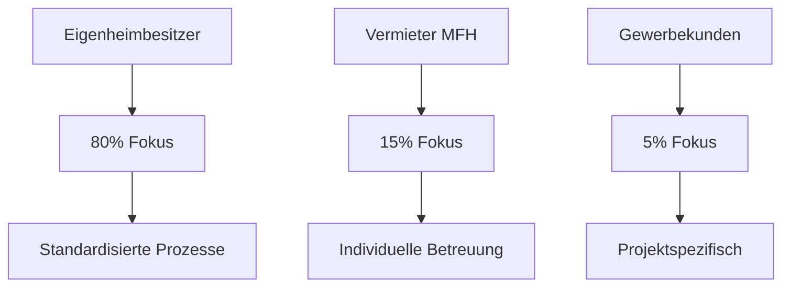

# Zielgruppen

## 🎯 Primäre und Sekundäre Zielgruppen

DWE & ARCAVIO fokussiert sich auf klar definierte Zielgruppen, die den größten Bedarf an energetischen Sanierungen haben und gleichzeitig die wirtschaftlichste Bearbeitung ermöglichen.

---

## 🏠 Primäre Zielgruppe: Eigenheimbesitzer

### Demografisches Profil
- **Alter**: 45-70 Jahre
- **Einkommen**: 60.000-150.000 € Haushaltsnettoeinkommen
- **Immobilie**: Einfamilienhaus/Doppelhaushälfte Baujahr 1960-2000
- **Region**: Aachen + 50km Umkreis
- **Familienstatus**: Meist Familien oder Empty Nester

### Charakteristika und Bedürfnisse

!!! info "Typische Ausgangssituation"
    - **Energiekosten**: 2.500-4.000 € jährlich
    - **Sanierungsstau**: Heizung/Dämmung 15+ Jahre alt
    - **Fördermotivation**: BAFA/KfW-Förderungen als Entscheidungshilfe
    - **Komfort**: Wunsch nach verbessertem Wohnklima
    - **Werterhalt**: Immobilie als Altersvorsorge

### Kundentypen

| Typ | Anteil | Motivation | Projektvolumen |
|-----|--------|------------|----------------|
| **Kostenbewusste** | 40% | Energiekosten senken | 30.000-60.000 € |
| **Komfortorientierte** | 35% | Wohnqualität verbessern | 50.000-100.000 € |
| **Umweltbewusste** | 25% | CO₂-Reduktion, Nachhaltigkeit | 40.000-80.000 € |

### Kaufverhalten
- **Informationsphase**: 6-12 Monate vor Entscheidung
- **Entscheidungskriterien**: Preis (30%), Qualität (25%), Förderung (20%), Vertrauen (25%)
- **Kommunikationskanäle**: Empfehlungen, Google, lokale Medien
- **Entscheidungsdauer**: 2-4 Monate nach Erstkontakt

---

## 🏢 Sekundäre Zielgruppe: Vermietenде Eigentümer

### Profil Mehrfamilienhaus-Eigentümer
- **Alter**: 35-60 Jahre
- **Typ**: Kapitalanleger, Wohnungsbaugenossenschaften
- **Objektgröße**: 4-20 Wohneinheiten
- **Investitionsvolumen**: 50.000-500.000 € pro Objekt

### Motivation und Ziele
- **Renditeoptimierung**: Mietsteigerungspotential durch Modernisierung
- **Werterhaltung**: Langfristige Wertsteigerung der Immobilie
- **Regulatorik**: Vorbereitung auf verschärfte Energiestandards
- **Steueroptimierung**: Nutzung von Abschreibungsmöglichkeiten

### Besondere Anforderungen
!!! example "Vermieter-spezifische Bedürfnisse"
    - **Wirtschaftlichkeit**: ROI-Berechnung über 10-15 Jahre
    - **Minimale Ausfallzeiten**: Sanierung bei laufendem Mietbetrieb
    - **Rechtssicherheit**: Compliance mit Mietrecht und EnEV
    - **Kommunikation**: Transparent gegenüber Mietern

---

## 🏗️ Tertiäre Zielgruppe: Gewerbliche Kunden

### Unternehmenskunden
- **Größe**: KMU mit 10-100 Mitarbeitern
- **Branchen**: Handwerk, Dienstleistung, Produktion
- **Immobilienart**: Bürogebäude, Werkstätten, Lagerhallen
- **Entscheidungsmotiv**: Betriebskosten reduzieren, Corporate Responsibility

### Spezielle Anforderungen
- **Produktionsausfall minimieren**: Sanierung in Betriebspausen
- **Komplexe Genehmigungen**: Bau-, Umwelt- und Arbeitsschutzrecht
- **Längere Entscheidungswege**: Geschäftsführung, Beirat, Banken
- **Höhere Projektvolumina**: 100.000-1.000.000 € typisch

---

## 📊 Zielgruppen-Matrix

### Marktpotential Region Aachen

| Zielgruppe | Anzahl Objekte | Ø Projektvolumen | Marktpotential | Bearbeitungsaufwand |
|------------|----------------|------------------|----------------|---------------------|
| **Eigenheimbesitzer** | 15.000 | 50.000 € | 750 Mio € | Mittel |
| **Vermieter MFH** | 800 | 150.000 € | 120 Mio € | Hoch |
| **Gewerbekunden** | 200 | 300.000 € | 60 Mio € | Sehr hoch |

### Prioritätsmatrix

---

## 🎪 Marketing & Ansprache

### Kommunikationsstrategie je Zielgruppe

#### Eigenheimbesitzer
**Kanäle:**
- Google Ads (lokale Suchanfragen)
- Facebook/Instagram (50+ Zielgruppe)
- Lokale Zeitungen & Anzeigenblätter
- Empfehlungsmarketing
- Messen & Veranstaltungen

**Botschaften:**
- "Energiekosten halbieren mit Förderung bis 70%"
- "Komplettlösung aus einer Hand"
- "Wohnkomfort steigern, Umwelt schonen"

#### Vermieter
**Kanäle:**
- Immobilienfachmagazine
- Hausverwaltungen als Partner
- Steuerberater-Netzwerk
- XING/LinkedIn

**Botschaften:**
- "ROI durch energetische Sanierung"
- "Rechtssichere Modernisierung"
- "Wertsteigerung bei laufendem Betrieb"

#### Gewerbekunden
**Kanäle:**
- Direktansprache
- IHK-Veranstaltungen
- B2B-Messen
- Branchenpresse

**Botschaften:**
- "Betriebskosten dauerhaft senken"
- "Corporate Responsibility umsetzen"
- "Förderungen für Unternehmen nutzen"

---

## 🔍 Kundensegmentierung

### Kundenklassifizierung nach Potential

| Klasse | Kriterien | Betreuungsintensität | Umsatzpotential |
|--------|-----------|---------------------|-----------------|
| **A-Kunden** | Projektvolumen >75k €, Weiterempfehlungen | Hoch | >100.000 € |
| **B-Kunden** | Projektvolumen 30-75k €, Standardsanierung | Mittel | 30-100.000 € |
| **C-Kunden** | Projektvolumen <30k €, Einzelmaßnahmen | Niedrig | <30.000 € |

### Customer Journey

!!! example "Typischer Kundenweg"
    
    **Awareness** (3-6 Monate)
    - Problem erkannt: hohe Energiekosten
    - Recherche zu Fördermöglichkeiten
    - Erste Informationsbeschaffung
    
    **Consideration** (2-4 Monate)  
    - Anbietervergleich
    - Erstberatung angefordert
    - Angebote eingeholt
    
    **Decision** (1-2 Monate)
    - Finanzierung geklärt
    - Förderantrag gestellt
    - Auftragsvergabe
    
    **Retention** (dauerhaft)
    - Projektabwicklung
    - Nachbetreuung
    - Weiterempfehlungen

---

## 📈 Marktbearbeitung 2025-2028

### Expansionsstrategie

| Jahr | Fokus-Zielgruppe | Geografische Ausweitung | Marketing-Budget |
|------|------------------|-------------------------|------------------|
| 2025 | Eigenheimbesitzer | Aachen City | 5.000 € |
| 2026 | EFH + MFH | Aachen + 25km | 8.000 € |
| 2027 | Alle Zielgruppen | Aachen + 50km | 12.000 € |
| 2028 | Skalierung | NRW-weit | 20.000 € |

### Erfolgsmessung

| KPI | Zielwert 2026 | Zielwert 2027 | Zielwert 2028 |
|-----|---------------|---------------|---------------|
| Leads EFH/Monat | 15 | 25 | 40 |
| Conversion Rate | 25% | 30% | 35% |
| Ø Projektvolumen | 45.000 € | 50.000 € | 55.000 € |
| Weiterempfehlungsrate | 85% | 90% | 95% |

---

*Die Zielgruppenbearbeitung wird kontinuierlich über Customer Feedback und Marktanalysen optimiert.*